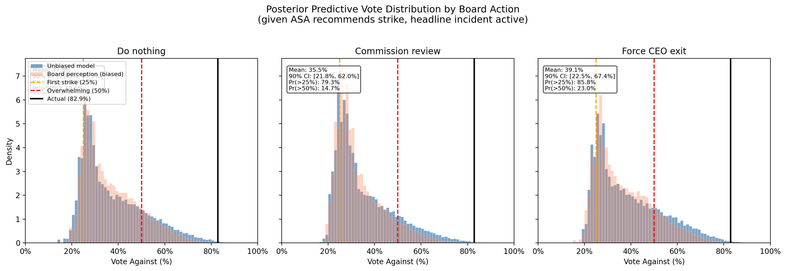
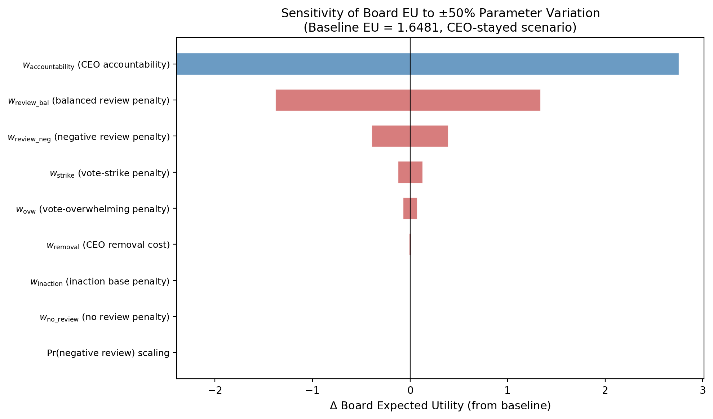
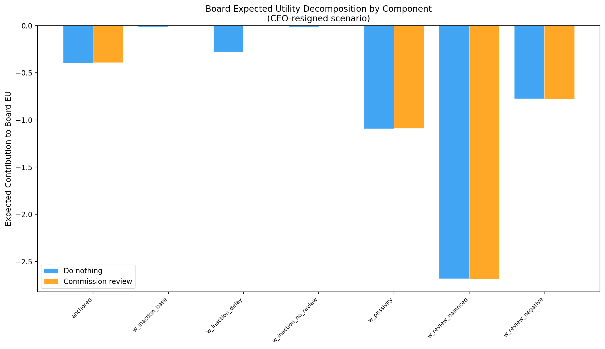

# Qantas Adversarial Risk Analysis (ARA)

A three-player adversarial risk analysis engine for Qantas governance decisions. The system combines Bayesian belief estimation (Stan) with game-theoretic tree recursion (Python) to compute optimal governance policies under strategic uncertainty.

**Actors:** Board, ASA (Australian Shareholders Association), CEO


## Architecture

The system is organized into two layers:

- **Layer A — Bayesian estimation (Stan):** Stan models (`models/belief_model.stan`, `models/media_better.stan`) produce belief checkpoint `.npz` files containing posterior draws for market/management beliefs and model parameters.
- **Layer B — Adversarial tree engine (Python):** The `engine/` package consumes checkpoints and Excel data contracts to evaluate governance decisions via ARA recursion.

## Project Structure

```
Qantas/
├── engine/                            # Core ARA engine package
│   ├── state.py                       # DecisionState, BeliefBundle, ParameterSampler
│   ├── chance_models.py               # VoteModel, ReviewModel (endogenous chance nodes)
│   ├── utilities.py                   # utility_board(), utility_asa(), utility_ceo()
│   ├── modes.py                       # ModeConfig: Board/ASA L1/L2 analysis modes
│   ├── predictive.py                  # PredictiveDistribution — ARA opponent modelling
│   ├── tree.py                        # TreeEvaluator — node-indexed recursion
│   └── solver.py                      # Solver — full orchestration across draws & actions
│
├── run/                               # CLI entry points
│   ├── run_unified_ARA.py             # Unified game tree (all strategic modes)
│   ├── run_board_mode.py              # Board-focal single-mode runner
│   ├── run_asa_mode.py                # ASA-focal single-mode runner
│   ├── game_tree.py                   # Fast tree builder with posterior weight draws
│   ├── interactive_tree.py            # Interactive HTML dashboard with LLM commentary
│   ├── visualise_tree.py              # Static tree visualization (PNG)
│   ├── sensitivity.py                 # Grid sensitivity analysis
│   └── apply_estimated_weights.py     # Apply quantification outputs to governance_spec
│
├── paper-results-pack.py              # Section 7 results: PPC, sensitivity, counterfactuals
├── board_utility_quantification.py    # Board utility parameter estimation pipeline
├── asa_utility_quantification.py      # ASA utility parameter estimation pipeline
│
├── utility-quantification/            # Quantification supporting files
│   ├── cache/                         # Board LLM response cache (SHA-256 keyed)
│   ├── asa-cache/                     # ASA LLM response cache
│   ├── ara_board_utility_experiment_spec.md  # Formal specification
│   └── what-was-built.md             # Implementation notes
│
├── data/
│   ├── governance_spec.xlsx           # Game tree structure, actions, utilities (8 sheets)
│   ├── opponent_priors.xlsx           # Prior distributions for opponent parameters
│   └── checkpoints/                   # Belief checkpoint .npz files (Cpre, C0–C3)
│
├── tests/
│   ├── test_engine.py                 # 151 tests across 17 test classes
│   └── create_test_data.py            # Generate synthetic checkpoint data
│
├── results-pack/                      # Paper Section 7 outputs (CSV tables, PNG figures)
├── outputs/                           # Results from run scripts (CSV, HTML dashboards)
├── models/                            # Stan models (belief_model.stan, media_better.stan)
├── docs/                              # Formal specifications and diagrams
└── requirements.txt
```

## Prerequisites

- Python 3.8+
- Dependencies: `pip install -r requirements.txt`
  - Core engine: numpy, pandas, openpyxl, cmdstanpy
  - Results & quantification: scipy, matplotlib, unidecode, json-repair
  - Interactive dashboard: instructor, openai, pydantic, python-dotenv, tqdm

## Quick Start

```bash
# Build all 4 strategic modes in one run, produces interactive HTML with mode selector
python -m run.run_unified_ARA --n_draws 500

# Generate paper results pack (Section 7 tables and figures)
python paper-results-pack.py --n_draws 500

# Run tests
python -m pytest tests/test_engine.py -v
```

## Run Scripts

### `run_unified_ARA.py` — Unified Game Tree

Builds all four strategic modes (All Stochastic, Board Strategic, ASA Strategic, CEO Strategic) in a single run. Produces one interactive HTML dashboard with a mode selector dropdown to switch between views in the browser — no need to re-run the script.

All three actor EU streams (Board, CEO, ASA) are propagated through every node. Board decisions always use argmax-count from posterior weight draws for stochastic probabilities. Generates PNG tree diagrams (stochastic mode) and interactive HTML dashboard with multi-actor utility decomposition.


| Argument            | Default                            | Description                                              |
| ------------------- | ---------------------------------- | -------------------------------------------------------- |
| `--n_draws`         | `500`                              | Number of posterior weight draws                         |
| `--posterior-draws` | `outputs/stan_posterior_draws.npz` | Path to posterior draws file                             |
| `--param-estimates` | `outputs/parameter_estimates.csv`  | Path to parameter estimates (for vote weights)           |
| `--no-laplacian`    | off                                | Disable Laplacian smoothing on stochastic decision probs |
| `--no-commentary`   | off                                | Skip LLM commentary in the interactive HTML dashboard    |
| `--seed`            | `42`                               | Random seed                                              |
| `--output`          | (none)                             | Output CSV path                                          |


### `paper-results-pack.py` — Paper Section 7 Results

Generates 6 analyses for the academic paper, output to `results-pack/`:


| Output                     | Format    | Description                                                          |
| -------------------------- | --------- | -------------------------------------------------------------------- |
| Posterior predictive check | CSV       | Model predictions vs actual 2023 AGM outcomes (5 events)             |
| Sensitivity analysis       | CSV + PNG | Tornado chart of Board EU sensitivity to utility parameters          |
| Counterfactual analysis    | CSV       | What-if Board chose differently at D1 (both scenarios)               |
| EU decomposition           | CSV + PNG | Board EU broken into weighted phi component contributions            |
| Vote distributions         | PNG       | Posterior predictive vote fraction per D1 action (unbiased + biased) |
| Value of information       | CSV       | Strategic value of early observation (ASA action, vote outcome)      |


```bash
python paper-results-pack.py --n_draws 500
```

### `sensitivity.py` — Parameter Sensitivity

Sweeps a grid over utility weights (81 combinations by default) and tracks how the optimal action shifts.


| Argument       | Default                           | Description                          |
| -------------- | --------------------------------- | ------------------------------------ |
| `--focal`      | `Board`                           | Focal actor (Board or ASA)           |
| `--checkpoint` | `C0`                              | Belief checkpoint                    |
| `--n_draws`    | `20`                              | Draws per grid point                 |
| `--K`          | `50`                              | Opponent samples (reduced for speed) |
| `--R_rollouts` | `25`                              | Rollouts (reduced for speed)         |
| `--n_workers`  | (auto)                            | Parallel worker processes            |
| `--seed`       | `42`                              | Random seed                          |
| `--no-board-prior` / `--no-ceo-prior` / `--no-asa-prior` | off | Disable Beta prior integration per actor |
| `--output`     | `outputs/sensitivity_results.csv` | Output path                          |


### `board_utility_quantification.py` — Board Utility Parameter Estimation

A supporting calibration pipeline that estimates the Board utility function weights using LLM stakeholder simulation (gpt-4o-mini). The engine (`run_unified_ARA.py`) uses the resulting parameter values from `governance_spec.xlsx`.

The pipeline uses a two-stage estimation strategy:

- **Stage 4A (Softmax MLE):** Estimates 10 action-varying parameters from choice probabilities
- **Stage 4B (Factor Rating OLS):** Estimates scenario-level parameters from LLM factor importance ratings

```bash
# Full pipeline (~$0.60 at gpt-4o-mini prices)
python board_utility_quantification.py --all

# Re-run estimation only (uses cached LLM responses)
python board_utility_quantification.py --stage 4,5,6

# Apply estimates to governance_spec.xlsx
python -m run.apply_estimated_weights outputs/parameter_estimates.csv

# Preview without writing
python -m run.apply_estimated_weights outputs/parameter_estimates.csv --dry-run
```


| Argument        | Default       | Description                           |
| --------------- | ------------- | ------------------------------------- |
| `--stage`       | `all`         | Comma-separated stages (1-6) or 'all' |
| `--model`       | `gpt-4o-mini` | LLM model for elicitation             |
| `--n_reps`      | `40`          | Repetitions per scenario              |
| `--n_starts`    | `10`          | L-BFGS-B starting points              |
| `--bootstrap_B` | `500`         | Bootstrap samples for SEs             |
| `--output_dir`  | `outputs/`    | Output directory                      |


Output: `outputs/board_utility_dashboard.html` (self-contained interactive dashboard with 12 tabs). See [docs/board-utility-quantification.md](docs/board-utility-quantification.md) for full documentation.

### `asa_utility_quantification.py` — ASA Utility Parameter Estimation

Estimates ASA utility weights using the same LLM stakeholder simulation framework. Uses context + interaction phi decomposition where context terms fire equally for both actions and interaction terms fire only for `rec_strike`.

```bash
# Full pipeline
python asa_utility_quantification.py --all

# Re-run estimation only
python asa_utility_quantification.py --stage 4,5,6
```

Output: `outputs/asa_utility_dashboard.html`.

## Game Tree

The analysis starts on **31-Aug-2023** (ACCC legal action against Qantas). The first branch point is the CEO's resignation decision on **05-Sep-2023**, which splits the tree into two scenarios:

```
D0_ceo  [CEO: resign or stay?]  (05-Sep-2023)
 │
 ├─ CEO_resign (actual: what happened)
 │   └─► D1  [Board: governance reform]
 │        ├─ D0_minimal  /  D1_review        ← no D3 (CEO already gone)
 │        └─► A2 → V → M_agm → D_rev → R → M_rev → Terminal
 │                                ↑ no Drev_sack_ceo     ↑ no D4
 │
 └─ CEO_stay (counterfactual)
     └─► D1  [Board: governance reform]
          ├─ D0_minimal  /  D1_review  /  D3_ceo_transition
          │
          └─► A2  [ASA: strike recommendation]
               ├─ A2_no_strike  /  A2_rec_strike
               │
               └─► V  [Nature: shareholder vote]
                    │   logit(V) ~ N(alpha + B_agm, sigma)
                    │
                    └─► M_agm  [Market reaction]
                         │
                         └─► D4  [CEO: respond]  (CEO has first-mover advantage)
                              ├─ D4_stay  /  D4_resign  /  D4_negotiate_exit
                              │
                              └─► D_rev  [Board: review / CEO removal]
                                   ├─ Drev_no_action  /  Drev_commission_review  /  Drev_sack_ceo
                                   │
                                   └─► R  [Nature: review findings]
                                        │   R ~ Dirichlet(38, 160, 1) → (negative, balanced, positive)
                                        │
                                        └─► M_rev  [Market reaction]
                                             │
                                             └─► D4_post_review / D_rev_post_review  (if adverse + CEO present)
                                                  │
                                                  └─► Terminal  →  compute utility
```

**Feasibility rules:** CEO removal at D3, D_rev, or D_rev_post_review automatically eliminates downstream CEO options. D3_ceo_transition requires `CEO_present` (infeasible if CEO already resigned). Review commission is gated by `review_not_commissioned`. Post-review round activates only on negative review findings with CEO still present.

## Data Contracts

### `governance_spec.xlsx` (8 sheets)


| Sheet                  | Contents                                                                           |
| ---------------------- | ---------------------------------------------------------------------------------- |
| `node_order`           | Node sequence, types (decision/chance/terminal), and owners                        |
| `action_sets`          | Actions per node with feasibility codes                                            |
| `vote_thresholds`      | Strike (25%) and overwhelming (50%) thresholds                                     |
| `utilities_board`      | Board utility weight parameters                                                    |
| `utilities_asa`        | ASA utility weight parameters                                                      |
| `utilities_ceo`        | CEO utility weight parameters                                                      |
| `policy_parameters`    | Fixed Level-1 policy parameters                                                    |
| `board_overconfidence` | Board cognitive bias: governance effect bounds + sigma_scale (Saar/Joyce evidence) |


### `opponent_priors.xlsx`

Prior distributions (normal, lognormal, beta, uniform, gamma) for each perspective-target actor pair used in ARA opponent modelling:

- Board's beliefs about ASA and CEO utility parameters
- ASA's beliefs about Board and CEO utility parameters

### Belief Checkpoints (`data/checkpoints/`)


| Checkpoint | Date       | Event                                   |
| ---------- | ---------- | --------------------------------------- |
| Cpre       | 2023-08-31 | ACCC legal action (analysis start date) |
| C0         | 2023-10-01 | Pre-mobilisation baseline               |
| C1         | 2023-10-10 | Governance review announced             |
| C2         | 2023-10-18 | ASA public mobilisation                 |
| C3         | 2023-11-03 | Pre-AGM peak distrust                   |


Each `.npz` contains 500 posterior draws: `B_mkt`, `B_mgmt`, `alpha_vote`, `gamma_A`, `gamma_AH`, `gamma_D`, `sigma_vote`, `review_param_1`, `review_param_2`.

## Engine Modules

### `state.py` — Game State & Data Loading

- **DecisionState** — Tracks `CEO_present`, `review_commissioned`, `review_completed`, `CEO_removed`, `CEO_resigned_early`, `headline_incident`, `post_review_round`. Enforces feasibility rules from `governance_spec.xlsx`. Provides `feasible_actions()`, `apply()`, `next_node()`, `for_scenario()`.
- **BeliefBundle** — Loads checkpoint `.npz` files. `get_draw(i)` returns all parameters for draw *i*.
- **ParameterSampler** — Samples opponent utility parameters from priors in `opponent_priors.xlsx`.

### `chance_models.py` — Stochastic Outcomes

- **VoteModel** — Vote percentage via logit-normal: `logit(V) ~ N(alpha + B_mkt + gamma_A * strike + gamma_AH * strike * headline + gamma_D * reform, sigma)`. ASA strike amplifies opposition; headline interaction (`gamma_AH`) further boosts it; governance reform dampens it. Board overconfidence bias scales sigma down (`sigma_scale < 1`) to model overprecision. Crisis floor via `Beta(50, 150)`.
- **ReviewModel** — Trinary findings via `Dirichlet(38, 160, 1)` over (negative, balanced, positive). Board-initiated crisis review: balanced dominates (~80%), negative ~19%, positive <1%.

### `utilities.py` — Actor Utility Functions


| Actor | Objective                                                   | Key terms                                                                                                                                                        |
| ----- | ----------------------------------------------------------- | ---------------------------------------------------------------------------------------------------------------------------------------------------------------- |
| Board | Minimize opposition & disruption                            | Vote penalty (quadratic above 25%), CEO loss cost with shock attenuation, reform implementation cost, review finding penalties, CEO accountability benefit       |
| ASA   | Maximize accountability outcomes                            | Vote reward (linear), CEO removal bonus, review commission bonus, mobilisation cost, context + interaction decomposition                                         |
| CEO   | Maximize CRRA wealth utility, minimize non-monetary penalty | U = W^(1-γ)/(1-γ) − λD; wealth by departure mode (W_resign, W_stay_sacked, W_stay_kept); graduated D penalties (D_sacked > D_resign_late > D_negotiate > D_stay) |


### `modes.py` — Analysis Configurations


| Mode                    | Focal | Opponents             | Level |
| ----------------------- | ----- | --------------------- | ----- |
| `MODE_BOARD`            | Board | ASA=ARA, CEO=ARA      | 1     |
| `MODE_ASA`              | ASA   | Board=ARA, CEO=ARA    | 1     |
| `MODE_BOARD_L2`         | Board | ASA=ARA, CEO=ARA      | 2     |
| `MODE_ASA_L2`           | ASA   | Board=ARA, CEO=ARA    | 2     |
| `MODE_ASA_POLICY_BOARD` | ASA   | Board=Policy, CEO=ARA | 1     |
| `MODE_BOARD_POLICY_ASA` | Board | ASA=Policy, CEO=ARA   | 1     |


### `predictive.py` — ARA Opponent Modelling

Computes predictive distributions over opponent actions. For each of *K* parameter samples from the focal actor's priors about the opponent: sample opponent utility parameters, evaluate *R* stochastic rollouts per feasible action, identify opponent's best response. Returns empirical distribution over best responses.

Level-2 modelling recurses: opponents model the focal actor strategically (with level decrement to prevent infinite recursion).

### `tree.py` — Game Tree Recursion

Node-indexed value computation:

- **Terminal:** compute utility for target actor
- **Chance (V, R):** Monte Carlo integration over sampled outcomes
- **Focal decision:** maximize over feasible actions
- **Opponent decision:** expectation weighted by predictive distribution

### `solver.py` — Orchestrator

`Solver.solve()` iterates over belief draws and feasible initial actions, delegates to `TreeEvaluator`, and returns a `SolveResult` with expected utilities, optimal action, and outcome statistics (Pr_strike, Pr_CEO_removed, mean_vote_percent, etc.). Accepts a `scenario` parameter (`"ceo_stayed"` or `"ceo_resigned"`) to condition the tree. `solve_scenarios()` runs both scenarios, computes the D0_ceo predictive distribution (Pr(CEO_resign) via ARA), and attaches predicted scenario probabilities to each result. `predict_d0_ceo()` returns the focal actor's ARA-predicted distribution over CEO's resign/stay decision.

## Output Format

```
checkpoint | scenario     | Pr_scenario | focal | mode       | action            | EU    | is_optimal
C0         | ceo_stayed   | 0.27        | Board | Board Mode | D0_minimal        | -0.42 | False
C0         | ceo_stayed   | 0.27        | Board | Board Mode | D1_review         | -0.38 | True
C0         | ceo_stayed   | 0.27        | Board | Board Mode | D3_ceo_transition | -0.50 | False
C0         | ceo_resigned | 0.73        | Board | Board Mode | D0_minimal        | -0.35 | False
C0         | ceo_resigned | 0.73        | Board | Board Mode | D1_review         | -0.30 | True
```

`Pr_scenario` is the ARA-predicted probability of the CEO's D0_ceo action from the focal actor's perspective.

Outcome statistics per action include: `Pr_strike`, `Pr_overwhelming`, `Pr_CEO_removed`, `Pr_review_adverse`, `mean_vote_percent`, `sd_vote_percent`.

## Results

Headline results from the paper results pack (`python paper-results-pack.py --n_draws 500`; full tables and figures in [results-pack/](results-pack/)).

### Posterior Predictive Check

Model predictions versus the actual 2023 AGM outcomes. The model correctly predicts four of the five observed events; the vote fraction is directionally right (a first strike well above the 25% threshold) but under-predicts the record 82.9% protest vote.

| Event | Predicted | Actual | Match |
| ----- | --------- | ------ | ----- |
| CEO departure (D0_ceo) | Pr(resign) = 96.2% | Resigned | ✅ |
| Board action (D1) | Commission review (Pr = 99.0%) | Commission review | ✅ |
| ASA recommendation (A2) | Pr(strike) = 95.1% | Strike recommended | ✅ |
| Vote fraction (V) | Mean = 35.6%, SD = 13.0%, 90% CI [22.1%, 62.3%] | 82.9% | ❌ |
| Review outcome (R) | Pr(balanced) = 80.4%, Pr(negative) = 19.1% | Balanced | ✅ |

Posterior predictive vote distributions per Board action (unbiased and overconfidence-biased):



### Counterfactual Analysis

Board expected utility if a different action had been taken at D1, in both pre-game scenarios. Commissioning a review is optimal in both worlds; forcing a CEO exit (only feasible if the CEO had stayed) is dominated.

| Scenario | D1 action | Board EU | ASA EU | Pr(strike) | Pr(CEO removed) | Optimal |
| -------- | --------- | -------- | ------ | ---------- | --------------- | ------- |
| CEO resigned | Do nothing | −5.47 | 2.13 | 0.84 | 1.00 | |
| CEO resigned | Commission review | −4.94 | 2.36 | 0.83 | 1.00 | ✅ |
| CEO stayed | Do nothing | 0.76 | 1.95 | 0.84 | 0.80 | |
| CEO stayed | Commission review | 1.69 | 2.21 | 0.84 | 0.80 | ✅ |
| CEO stayed | Force CEO exit | 1.64 | 2.71 | 0.82 | 1.00 | |

### Sensitivity Analysis

Tornado chart of Board expected utility under ±50% scaling of each utility parameter. The CEO accountability weight and the review finding penalties dominate; vote penalties matter moderately; the review probability scaling and inaction penalties are negligible.



### Expected Utility Decomposition

Board EU broken into weighted phi component contributions per D1 action:



### Value of Information

The strategic value to the Board of observing a signal before committing at D1 is small — the optimal action (commission review) is robust to what ASA recommends and how the vote lands.

| Information signal | Baseline EU | EU with perfect information | Value of information |
| ------------------ | ----------- | --------------------------- | -------------------- |
| ASA recommendation (A2) | −4.953 | −4.934 | 0.019 (0.4%) |
| Vote outcome (V) | −4.953 | −4.950 | 0.004 (0.1%) |

## Key Design Decisions

- **D0_ceo as a genuine decision node** — CEO resignation (05-Sep-2023) is modelled as a strategic decision, not an exogenous parameter. The Board/ASA uses ARA opponent modelling to predict Pr(CEO_resign), while feasibility rules automatically prune downstream nodes when `CEO_present=False`
- **Level-1 and Level-2 opponent modelling** with recursion guard (level decrement prevents infinite loops)
- **Rollout-based Psi computation** (configurable K opponent samples, R rollouts)
- **All parameters externalized to Excel** — no magic numbers in code
- **Focal symmetry verified:** swapping Board/ASA flips max/expectation at decision nodes
- **CEO removal automatically eliminates D4 nodes** via feasibility rules
- **Post-review round** for negative findings with CEO present — enables second-stage Board/CEO interaction
- **CEO loss shock attenuation** — strike, overwhelming vote, and adverse review progressively reduce Board's cost of CEO removal
- **Trinary review model** — Dirichlet(38, 160, 1) over negative/balanced/positive findings replaces binary adverse/benign
- **D0_ceo prior** — Jeffreys Beta(0.5, 0.5) + 12 Australian no-contrition CEO departures → Beta(12.5, 0.5), mean 96.2%

## Tests

151 tests across 17 classes covering data loading, feasibility rules, chance models, utilities, mode configurations, predictive distributions, tree evaluation, solver integration, spec validation, edge cases, overconfidence bias, D0_ceo decision node, scenario conditioning, scenario utilities, Laplace smoothing, post-review round, and interactive tree output.

```bash
python -m pytest tests/test_engine.py -v
```

