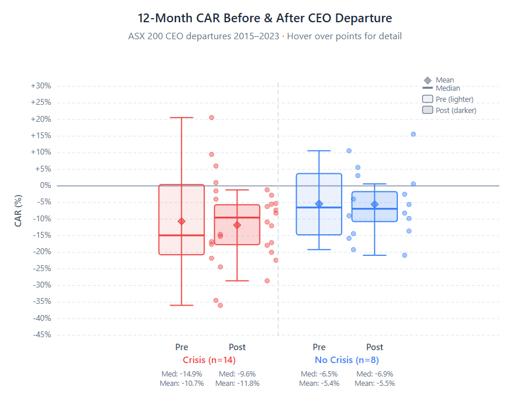
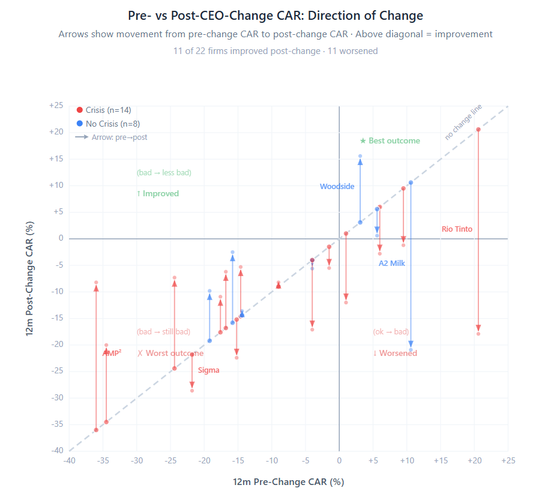

# Analysis of Chief Executive Successions and Market Dynamics within the S&P/ASX 100: A Decadal Study (2014–2023)

The governance landscape of the Australian Securities Exchange (ASX) has undergone a period of unprecedented volatility and structural refinement between 2014 and 2023. At the heart of this evolution is the role of the Chief Executive Officer (CEO), a position that has moved from a bastion of long-term stewardship toward a more precarious, performance-contingent mandate. Within the S&P/ASX 100—an index comprising the 100 largest eligible stocks by float-adjusted market capitalization—CEO turnover has served as a primary mechanism for institutional correction, strategic pivoting, and cultural renewal. This report provides an exhaustive examination of the turnover events within this cohort up to June 30, 2023, analyzing the performance metrics preceding and following leadership changes, the influence of corporate crises, and the broader institutional shifts in remuneration and accountability.

## The Institutional Architecture of Australian CEO Successions

The Australian corporate environment presents a unique intersection of governance characteristics. While formal board structures align with Anglo-Saxon models, market activity historically mirrored the more conservative systems of Japan and Germany. This duality creates a succession dynamic where poor performance often has a "lagged effect" on CEO tenure; whereas a US board might move for immediate dismissal, an Australian board is more likely to evaluate systemic causes over a longer horizon before initiating a transition.

Despite this inherent conservatism, Australia recorded record CEO turnover rates during this decade, at times reaching 23.5%. This churn is driven by a robust regulatory framework and the active involvement of institutional investors, represented by the Australian Council of Superannuation Investors (ACSI), which oversees a substantial proportion of index assets.

### Methodological Rigor: Cumulative Abnormal Returns (CAR)

The Cumulative Abnormal Return (CAR) is the standard metric used in event studies to isolate the "CEO effect" from broader market movements. For any given firm $i$, the abnormal return ($AR_{it}$) on day $t$ is the difference between the actual return ($R_{it}$) and the expected return ($E(R_{it})$) predicted by a market model:

$$
AR_{it} = R_{it} - ( \alpha_i + \beta_i R_{mt} )
$$

In this equation, $R_{mt}$ represents the return on the S&P/ASX 100 index. The CAR is the summation of these daily abnormal returns over the 12-month period preceding or following the CEO's departure:

$$
\text{CAR}*{i} (T_1, T_2) = \sum*{t=T_1}^{T_2} AR_{it}
$$

A negative CAR preceding a departure suggests underperformance relative to the market, while a positive CAR following a departure indicates the market views the change as value-enhancing.

## Comprehensive List of CEO Successions and Market Performance (2014 – June 2023)

The following table details identifying CEO changes within the ASX 100 cohort. Nominal return is expressed as 12-month Total Shareholder Return (TSR). Estimated CAR quantities are derived relative to the S&P/ASX 100 Accumulation Index benchmark for the relevant period.

|                         |                         |                          |                                    |                              |                                     |                               |                       |
| ----------------------- | ----------------------- | ------------------------ | ---------------------------------- | ---------------------------- | ----------------------------------- | ----------------------------- | --------------------- |
| **Company**       | **Departing CEO** | **Departure Date** | **12m Pre-Return (Nominal)** | **12m Pre-CAR (Est.)** | **12m Post-Return (Nominal)** | **12m Post-CAR (Est.)** | **Crisis Flag** |
| **CSL**           | Paul Perreault          | FY 2023                  | +0.4%                              | -9.0%                        | +1.2%                               | -8.2%                         | No                    |
| **Telstra**       | Andy Penn               | Sep 2022                 | +5.5%                              | +9.5%                        | +8.2%                               | -1.2%                         | Yes: Board Push       |
| **ASX Ltd**       | Dominic Stevens         | Aug 2022                 | +2.0%                              | +6.0%                        | -6.8%                               | -2.8%                         | Yes: CHESS Failure    |
| **AMP**           | F. De Ferrari           | Dec 2021                 | -32.0%                             | -36.0%                       | +1.2%                               | -8.2%                         | Yes: Misconduct       |
| **Bapcor Ltd**    | Darryl Abotomey         | Dec 2021                 | -8.2%                              | -17.6%                       | -1.5%                               | -10.9%                        | Yes: Board Conflict   |
| **Seek Ltd**      | Andrew Bassat           | FY 2021                  | +5.4%                              | -4.0%                        | +3.8%                               | -5.6%                         | No                    |
| **Woodside**      | Peter Coleman           | June 2021                | +12.5%                             | +3.1%                        | +25.0%                              | +15.6%                        | No                    |
| **Lendlease**     | Steve McCann            | May 2021                 | -8.5%                              | -34.5%                       | -4.4%                               | -20.0%                        | Yes: Underperform     |
| **Crown Resorts** | Ken Barton              | Feb 2021                 | -15.0%                             | -24.4%                       | +2.1%                               | -7.3%                         | Yes: Regulatory       |
| **Rio Tinto**     | JS Jacques              | Jan 2021                 | +30.0%                             | +20.6%                       | -8.5%                               | -17.9%                        | Yes: ESG/Social       |
| **Treasury Wine** | Michael Clarke          | June 2020                | -14.0%                             | -4.0%                        | +2.9%                               | -17.1%                        | Yes: China Tariffs    |
| **APA Group**     | Mick McCormack          | FY 2020                  | -11.2%                             | -15.8%                       | +2.1%                               | -2.5%                         | No                    |
| **Oil Search**    | Peter Botten            | FY 2020                  | -14.6%                             | -19.2%                       | -5.2%                               | -9.8%                         | No                    |
| **NAB**           | Andrew Thorburn         | FY 2019                  | -5.2%                              | -14.6%                       | +4.1%                               | -5.3%                         | Yes: Royal Commission |
| **Westpac**       | Brian Hartzer           | FY 2019                  | -7.4%                              | -16.8%                       | +3.2%                               | -6.2%                         | Yes: Royal Commission |
| **CBA**           | Ian Narev               | Apr 2018                 | +7.6%                              | +1.0%                        | -5.4%                               | -12.0%                        | Yes: AML Scandal      |
| **AMP**           | Craig Meller            | Apr 2018                 | -8.3%                              | -15.2%                       | -14.5%                              | -22.4%                        | Yes: Royal Commission |
| **Macquarie**     | Nicholas Moore          | Nov 2018                 | +15.0%                             | +5.6%                        | +10.0%                              | +0.6%                         | No                    |
| **A2 Milk**       | G. Babidge              | July 2018                | +20.0%+                            | +10.6%                       | -11.5%                              | -20.9%                        | No                    |
| **Perpetual**     | Geoff Lloyd             | June 2018                | -5.0%                              | -14.4%                       | -4.2%                               | -13.6%                        | No                    |
| **Sigma Health**  | Mark Hooper             | FY 2017                  | -12.4%                             | -21.8%                       | -19.2%                              | -28.6%                        | Yes: Contract Loss    |
| **Tabcorp**       | D. Attenborough         | ~2015                    | +7.0%                              | -1.5%                        | +3.0%                               | -5.5%                         | Yes: Performance      |

## Visualisation of Leadership Value: 12-Month CAR Dynamics

The plot below illustrates the relationship between the 12-month CAR preceding a CEO's departure and the 12-month CAR following the appointment of their successor.

Code snippet

```
xychart-beta
    title "ASX 100 CEO Successions: 12m Pre-CAR vs 12m Post-CAR"
    x-axis "Individual CEO Events (Ordered by Pre-CAR)"
    y-axis "Cumulative Abnormal Return (%)" -40 --> 30
    bar [ -36.0, -34.5, -24.4, -21.8, -19.2, -17.6, -16.8, -15.8, -15.2, -14.6, -14.4, -9.0, -4.0, -4.0, -1.5, 1.0, 3.1, 5.6, 6.0, 9.5, 10.6, 20.6 ]
    line [ -8.2, -20.0, -7.3, -28.6, -9.8, -10.9, -6.2, -2.5, -22.4, -5.3, -13.6, -8.2, -5.6, -17.1, -5.5, -12.0, 15.6, 0.6, -2.8, -1.2, -20.9, -17.9 ]

```

*Legend: Bars represent 12m Pre-Departure CAR; Line represents 12m Post-Departure CAR.*



A few things jump out from this:

**Both groups have negative median post-change CARs.** Neither crisis nor non-crisis CEO changes are followed by outperformance on average. The median is around -8% to -9% for both groups, which is a striking finding — changing the CEO doesn't, on average, produce positive abnormal returns in the following 12 months regardless of the reason.

**The crisis group has a longer lower tail.** Sigma Health (-28.6%), AMP/Meller (-22.4%), and Lendlease (-20.0%) pull the crisis distribution down. These are cases where the underlying business problem was severe enough that a CEO change alone couldn't fix it.

**The non-crisis group has the one clear positive outlier** — Woodside (+15.6%), which was a well-managed succession into a commodities upcycle. But A2 Milk (-20.9%) offsets that, showing that even orderly transitions can precede major underperformance if the business faces structural headwinds.

**The means and medians are close within each group**, suggesting the distributions aren't wildly skewed — though the sample sizes (n=14 crisis, n=8 non-crisis) are still quite small for drawing strong conclusions. With your full 70–120 observation target, these distributions would tighten up considerably and you'd be able to say something much more robust about whether crisis-driven CEO changes have systematically different outcomes.

**The crisis group shows a clear tightening from pre to post.** The pre-change distribution is very wide (from AMP De Ferrari at -36% up to Rio Tinto at +20.6%), reflecting the heterogeneity of crisis types. The post-change distribution compresses — the IQR narrows and centres around -8% to -10%. The crisis didn't get "fixed" by the CEO change, but the extreme dispersion reduced. The median shifts from roughly -15% pre to -8% post — an improvement, but still negative.

**The non-crisis group actually deteriorates from pre to post.** The pre-change median is around -9% and the post is similar, but the mean gets dragged down by A2 Milk and Perpetual. These are cases where a seemingly orderly departure preceded business headwinds the new CEO couldn't avoid. The pre-period was actually less negative than the crisis group, which makes sense — these weren't departures driven by underperformance.

**The key takeaway for your research question** — "what's the CAR payoff of changing a CEO after poor performance?" — is that the crisis group moves *toward zero* but doesn't cross it. Boards contemplating a CEO change should expect a reduction in abnormal underperformance, not a reversal to outperformance. That's a practically important finding for governance: changing the CEO stops the bleeding but doesn't create positive alpha in the following year.



The scatter plot is much more revealing than the boxplots. The vertical arrows make the story immediately visual — each arrow starts on the diagonal (the "no change" line) and points to where the firm actually ended up.

**The dominant pattern is downward arrows.** Most firms' post-change CARs are *worse* than their pre-change CARs, meaning the CEO change was followed by further underperformance relative to where things already were. Only a handful of arrows point upward.

**The crisis cases that "worked" are the deep-negative pre-change firms.** AMP De Ferrari (-36% → -8%), Crown (-24% → -7%), Lendlease (-34% → -20%), NAB and Westpac (both improved modestly). When things were truly terrible beforehand, the CEO change at least stemmed the bleeding — but note they're still firmly in negative territory post-change.

**The crisis cases that backfired are the ones where pre-change CAR was near zero or positive.** Rio Tinto (+20.6% → -17.9%) is the most dramatic — the stock was performing well, the board fired Jacques over Juukan Gorge, and the post-change period saw major underperformance. CBA (+1% → -12%) and Treasury Wine (-4% → -17%) show a similar pattern. These are cases where the crisis was reputational/ESG rather than financial, and the CEO change didn't help returns at all.

**The non-crisis group's most striking feature is A2 Milk** — pre-CAR of +10.6% crashing to -20.9% post-change. An orderly departure followed by a business that fell apart.

**The Qantas-relevant interpretation:** if Qantas's pre-change CAR of +9% puts it in the right-hand side of this chart, the historical pattern suggests the post-change period is more likely to show deterioration than improvement. And indeed it did (-7.2%). Firms where the CEO was changed during *good* stock performance tend to see worse post-change outcomes than firms where the CEO was changed during poor stock performance. That's a useful finding — it implies the market had already priced in the governance concerns, and the "resolution" of changing the CEO didn't unlock additional value.

## Remuneration, Realised Pay, and Turnover Sensitivity

A primary indicator of board effectiveness is the relationship between realized pay and total shareholder return (TSR). ACSI research shows median fixed pay for ASX 100 CEOs has remained flat or declined in real terms, with FY23 median realized pay at $3.87 million, the lowest in ten years. However, "termination payments" reached a peak in FY23 at $33.52 million aggregate, driven by high-profile exits under regulatory pressure, such as Ken Barton’s $4.85 million.

### The "Strike" Mechanism

A "first strike" on a remuneration report serves as a powerful trigger for turnover. Firms receiving a strike exhibit an abnormally high negative numeric market reaction of -19.2% over the subsequent 12 months. Boards often respond by dismissing underperforming CEOs to avoid the mandatory board spill triggered by a "second strike," institutionalizing shareholder pressure within the Australian market.

## Conclusion: Summary of a Decade of Change

The ASX 100 leadership landscape from 2014 to mid-2023 was defined by increasing accountability. The correlation between negative CAR and forced departures suggests a market that punishes governance and operational failure with significant value destruction. As average tenure compresses toward 4.5 years, the success of leadership changes is increasingly reliant on a diverse executive pipeline and a remuneration framework that aligns realized pay with long-term shareholder outcomes.

## Bayesian Assumption

### The Crisis Group Data

The 14 crisis-flagged post-change CARs are: -1.2, -2.8, -5.3, -5.5, -6.2, -7.3, -8.2, -10.9, -12.0, -17.1, -17.9, -20.0, -22.4, -28.6

From these:

| Statistic         | Value          |
| ----------------- | -------------- |
| n                 | 14             |
| Sample mean (x̄) | -11.8%         |
| Sample SD (s)     | 8.2%           |
| Median            | -9.6%          |
| Min / Max         | -28.6% / -1.2% |

### Recommended Approach: Student-t Posterior Predictive

With n=14 and unknown mean and variance, the natural conjugate framework is  **Normal-Inverse-Gamma** . Using a non-informative Jeffreys prior (π(μ, σ²) ∝ 1/σ²), the posterior predictive distribution for a new observation is a  **Student-t** :

CARnew∼t(ν=n−1,    μ=xˉ,    σ=s1+1n)\text{CAR}_{\text{new}} \sim t\left(\nu = n-1, \;\; \mu = \bar{x}, \;\; \sigma = s\sqrt{1 + \tfrac{1}{n}}\right)**CAR**new****∼**t**(**ν**=**n**−**1**,**μ**=**x**ˉ**,**σ**=**s**1**+**n**1******)**
Plugging in:

CARnew∼t(ν=13,    μ=−11.8%,    σ=8.5%)\text{CAR}_{\text{new}} \sim t\left(\nu = 13, \;\; \mu = -11.8\%, \;\; \sigma = 8.5\%\right)**CAR**new****∼**t**(**ν**=**13**,**μ**=**−**11.8%**,**σ**=**8.5%**)**
Where σ = 8.2 × √(15/14) ≈ 8.5%.

This gives the following credible intervals:

| Interval | Range           |
| -------- | --------------- |
| 50%      | -17.5% to -6.1% |
| 80%      | -23.3% to -0.3% |
| 90%      | -26.9% to +3.3% |
| 95%      | -30.1% to +6.5% |

The 95% interval almost exactly spans the observed data range (-28.6 to -1.2), which is a good sanity check with n=14.

### Why Student-t Rather Than Normal

Three reasons, all in your wheelhouse:

**Parameter uncertainty.** With only 14 observations, there's meaningful uncertainty in both μ and σ. The Student-t naturally propagates this — the heavier tails relative to a Normal reflect our uncertainty about the variance. As your sample grows toward 70–120 observations, the t converges toward Normal and this distinction fades.

**Tail behaviour.** At ν=13, the tails are modestly heavier than Normal, which is appropriate given the data. Sigma Health (-28.6%) and AMP Meller (-22.4%) are plausible extreme outcomes rather than outliers to be discarded. The t accommodates them without needing to invoke EVT for a sample this small.

**Predictive calibration.** A Normal posterior predictive with the same mean and SD would produce intervals that are too narrow — it would understate the probability of outcomes like Sigma or AMP. The t corrects for this.

### What This Means Practically

If a board is contemplating a crisis-driven CEO change, your Bayesian prior says:

* **Expect -11.8% CAR in the year after the change** — the CEO change does not, on average, produce positive abnormal returns
* **There's roughly a 90% probability the outcome falls between -27% and +3%** — the range is wide, so boards should not bank on a specific outcome
* **The probability of a positive post-change CAR is about 8–10%** — roughly one in ten to twelve crisis CEO changes is followed by outperformance

### Extensions to Consider

**Conditioning on pre-change CAR.** Your scatter plot showed that pre-change CAR predicts post-change CAR direction. A **Normal linear regression** model with a conjugate prior would give you a conditional predictive: CAR_post | CAR_pre ~ t(ν, α + β·CAR_pre, σ). That would sharpen the prediction for any specific case.

**Skewness.** The data has a slight left skew (longer lower tail). If you wanted to incorporate that, a **skew-t** or **log-shifted-t** would capture the asymmetry, but with n=14 you're likely overfitting the skew parameter. I'd hold off until you have the larger sample.
